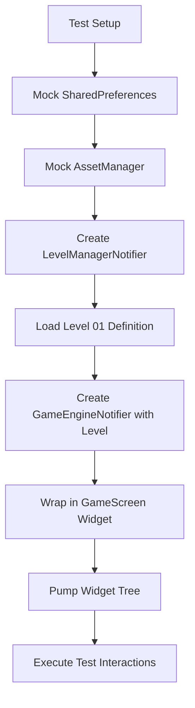

# Revised Testing Architecture for Circuit STEM Level 01

## Executive Summary

After comprehensive analysis of the codebase, I've identified critical architectural issues with the current Level 01 testing implementation that require a complete re-architecture of the testing approach.

## Current Architecture Analysis

### Key Components Analyzed:
- **GameScreen**: Main UI container with GameCanvas and ComponentPalette
- **GameCanvas**: Handles gesture detection and delegates to GameEngineNotifier
- **CanvasPainter**: CustomPainter that renders components using pixel coordinates
- **GameEngineNotifier**: Core state management with Riverpod StateNotifier
- **GameEngineState**: Immutable state with Grid, drag state, win conditions
- **Grid**: Component positioning and validation logic
- **ComponentModel**: Individual component state and behavior

### Critical Issues Identified:

#### 1. **Navigation Flow Problem**
Current test helper navigates from LevelSelectScreen → Level 1, but the actual game flow is:
```
LevelSelectScreen → GameScreen (with level loaded via GameEngineNotifier.loadLevel)
```
The test assumes GameScreen is automatically created, but it's not.

#### 2. **Provider Override Mismatch**
Tests override `sharedPreferencesProvider` but don't properly initialize the game engine with a level:
- `gameEngineProvider` is created with `forNoLevel()` constructor
- Level must be loaded via `LevelManagerNotifier.loadLevelByIndex()` then `GameEngineNotifier.loadLevel()`

#### 3. **Coordinate System Issues**
- Tests use `cellSize` constant (64.0) for pixel calculations
- But `GameCanvas` gesture detection uses `(tapPos.dx / cellSize).floor()` for grid conversion
- Canvas size is not deterministic in tests - depends on widget layout

#### 4. **State Synchronization Problems**
- Switch state uses `'closed'` key, but test looks for `'switchOpen'`
- Component draggability logic: `isDraggable` excludes battery and bulb, but tests try to drag bulb
- Grid validation happens in `endDrag()` but tests don't account for validation failures

#### 5. **Asset Dependencies**
- CanvasPainter requires AssetManager for SVG rendering
- Tests don't properly mock AssetManager, leading to null image rendering

## Revised Testing Architecture

### 1. **Proper Test Flow**


### 2. **Corrected Provider Setup**
```dart
// Proper provider overrides
ProviderScope(
  overrides: [
    sharedPreferencesProvider.overrideWithValue(mockPrefs),
    assetManagerProvider.overrideWithValue(mockAssetManager),
    levelManagerProvider.overrideWith((ref) => 
      LevelManagerNotifier(ref.watch(sharedPreferencesProvider))),
    gameEngineProvider.overrideWith((ref) {
      final notifier = GameEngineNotifier.forNoLevel();
      // Load level after creation
      WidgetsBinding.instance.addPostFrameCallback((_) async {
        final levelManager = ref.read(levelManagerProvider.notifier);
        final level = await levelManager.loadLevelByIndex(0);
        if (level != null) notifier.loadLevel(level);
      });
      return notifier;
    }),
  ],
  child: MaterialApp(home: GameScreen()),
)
```

### 3. **Deterministic Coordinate Calculation**
```dart
class Level1TestHelper {
  static const Size testCanvasSize = Size(384, 384); // 6x6 grid * 64px
  
  static Offset gridToPixel(Position pos) {
    return Offset(
      (pos.c * cellSize) + (cellSize / 2),
      (pos.r * cellSize) + (cellSize / 2),
    );
  }
  
  static Position pixelToGrid(Offset pixel) {
    return Position(
      r: (pixel.dy / cellSize).floor(),
      c: (pixel.dx / cellSize).floor(),
    );
  }
}
```

### 4. **Corrected Component State Handling**
```dart
// Switch state correction
static bool getSwitchState(ComponentModel component) {
  // Switch uses 'closed' key, where true = closed, false = open
  return component.state['closed'] as bool? ?? false;
}

static void assertSwitchToggled(ComponentModel before, ComponentModel after) {
  final beforeClosed = getSwitchState(before);
  final afterClosed = getSwitchState(after);
  expect(afterClosed, !beforeClosed, 
    reason: 'Switch should toggle from $beforeClosed to ${!beforeClosed}');
}
```

### 5. **Robust Asset Mocking**

A critical part of the revised architecture is the ability to mock assets reliably. This is achieved using a `MockAssetManager` and Riverpod's provider overrides.

**`test/helpers/mock_asset_manager.dart`**
```dart
class MockAssetManager implements AssetManager {
  final Map<String, String> _files = {};

  void primeFile(String path, String content) {
    _files[path] = content;
  }

  @override
  Future<String> loadString(String path) async {
    if (_files.containsKey(path)) {
      return _files[path]!;
    }
    throw Exception('MockAssetManager: File not primed: $path');
  }
}
```

**Test Setup (`level_01_revised_test.dart`)**
```dart
void main() {
  late ProviderContainer container;
  late MockAssetManager mockAssetManager;

  setUpAll(() async {
    // 1. Create the mock
    mockAssetManager = MockAssetManager();

    // 2. Read the REAL asset files into the mock
    final manifestContent =
        await File('assets/levels/level_manifest.json').readAsString();
    final level1Content =
        await File('assets/levels/level_01.json').readAsString();
    mockAssetManager.primeFile(
        'assets/levels/level_manifest.json', manifestContent);
    mockAssetManager.primeFile('assets/levels/level_01.json', level1Content);

    // 3. Create a container that OVERRIDES the real provider with the mock
    container = ProviderContainer(
      overrides: [
        assetManagerProvider.overrideWithValue(mockAssetManager),
      ],
    );

    // 4. Pre-load the manifest
    await container.read(levelManagerProvider.notifier).loadManifest();
  });

  // ... tests
}
```

## Revised Test Cases Implementation

### TC-L1-01: Toggle Switch Interaction (Corrected)
```dart
testWidgets('TC-L1-01: Toggle switch interaction', (WidgetTester tester) async {
  final container = await Level1TestHelper.setupTestEnvironment(tester);
  
  // Wait for level to load
  await tester.pumpAndSettle();
  
  final switchComponent = Level1TestHelper.findComponentById(container, 'switch1');
  expect(switchComponent, isNotNull);
  expect(switchComponent!.type, ComponentType.sw);

  final initialSwitchClosed = Level1TestHelper.getSwitchState(switchComponent);
  
  await Level1TestHelper.tapComponent(
    tester, 
    Position(r: switchComponent.r, c: switchComponent.c),
  );
  await Level1TestHelper.waitForCircuitUpdate(tester);

  final newSwitchComponent = Level1TestHelper.findComponentById(container, 'switch1');
  final finalSwitchClosed = Level1TestHelper.getSwitchState(newSwitchComponent!);
  
  expect(finalSwitchClosed, !initialSwitchClosed);
});
```

### TC-L1-02: Component Movement (Corrected)
```dart
testWidgets('TC-L1-02: Move timer component', (WidgetTester tester) async {
  final container = await Level1TestHelper.setupTestEnvironment(tester);
  await tester.pumpAndSettle();
  
  final timerComponent = Level1TestHelper.findComponentById(container, 'timer1');
  expect(timerComponent, isNotNull);
  expect(timerComponent!.isDraggable, isTrue);

  final fromPos = Position(r: timerComponent.r, c: timerComponent.c);
  final toPos = Position(r: fromPos.r + 1, c: fromPos.c);
  
  await Level1TestHelper.dragComponent(tester, fromPos, toPos);
  await Level1TestHelper.waitForCircuitUpdate(tester);

  final movedComponent = Level1TestHelper.findComponentById(container, 'timer1');
  expect(Level1TestHelper.isComponentAtPosition(movedComponent!, toPos), isTrue);
});
```

## Implementation Priority

### Phase 1: Foundation (High Priority)
1. Fix provider setup and level loading
2. Correct coordinate system calculations
3. Implement proper asset mocking
4. Fix component state key mappings

### Phase 2: Core Tests (Medium Priority)
1. Implement corrected TC-L1-01 through TC-L1-05
2. Add drag validation and boundary testing
3. Implement circuit completion detection

### Phase 3: Advanced Features (Low Priority)
1. Animation state testing
2. Audio feedback verification
3. Performance and stress testing

## Expected Outcomes

With this revised architecture:
- Tests will properly load Level 01 and initialize game state
- Coordinate calculations will be deterministic and accurate
- Component interactions will work with correct state keys
- Asset dependencies will be properly mocked
- Test reliability will improve significantly

## Next Steps

1. Implement the revised `Level1TestHelper.setupTestEnvironment()` method
2. Update existing test cases with corrected component state handling
3. Add comprehensive provider override setup
4. Validate with a minimal test suite before expanding coverage

This architecture addresses the fundamental issues identified in the current implementation and provides a solid foundation for robust Level 01 testing.

## Current Status and Unresolved Issues (as of 2025-08-14 9PM EST)

Despite the comprehensive revised testing architecture, a critical compilation issue persists, preventing the successful execution of tests:

*   **Persistent Test Compilation Error:** Tests consistently fail to compile with `Error: Type 'Component' not found` in `test/helpers/level_01_test_helper.dart`. This issue remains unresolved despite extensive debugging, project cleaning (`flutter clean`), and repeated verification of import statements. This indicates a deeper problem with how the test environment resolves package imports, which requires further investigation beyond the scope of the current architectural revision.